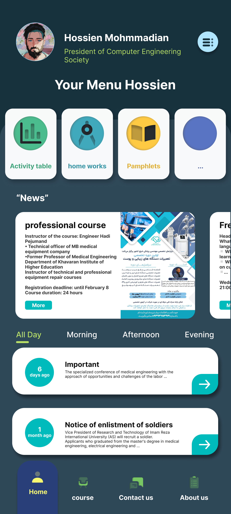
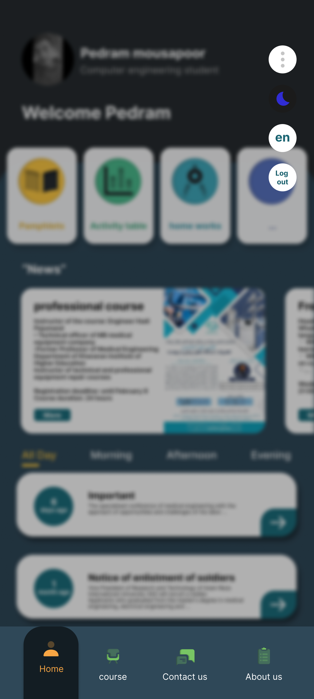
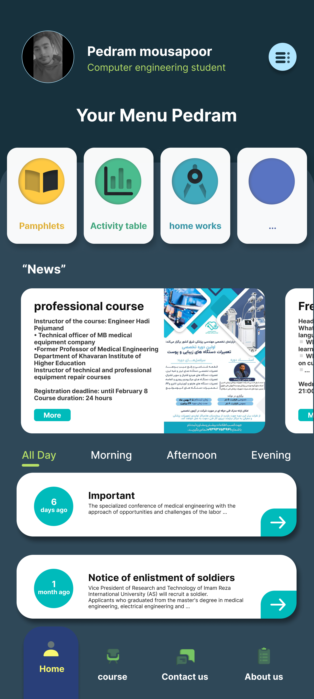
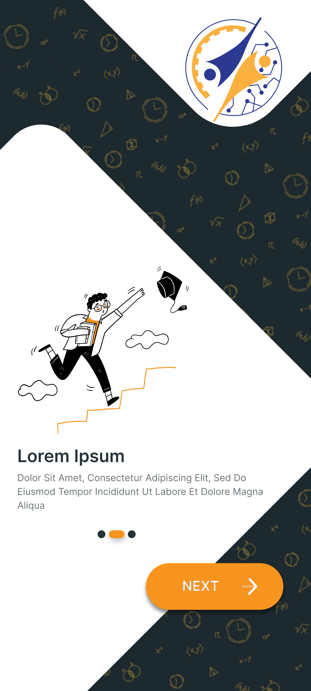

  
  <h1>Anjoman</h1>
  
Association is an application for academic associations and academic groups to improve communication between students and professors with the association.

## Demo

## Documentation
All the documents in the directory ["docs"](/docs/readme.md) and online will be placed on the [site soon](https://github.com/HossienHunTa/anjoman-application). If you intend to develop software, you can read  [this section](/docs/dev.md).

## Acknowledgements

 - [Pedram Mousapoor](https://www.linkedin.com/in/pedram-mousapoor-92a940261/) for the UI&UX design of this app

## Authors

- [Hossien Mohmmadian](https://www.github.com/hossienhunta)
- [Pedram Mousapoor](https://www.linkedin.com/in/pedram-mousapoor-92a940261/)

## Environment Variables

To run this project, you need to add the following environment variables to your .env file.

| Name             | Type                                                                 |
| ----------------- | ------------------------------------------------------------------ |
| `dbHOST` | String |
| `dbPORT` | Int |
| `dbDATABASE` | String |
| `dbUSERNAME` | String |
| `dbPASSWORD` | String |
| `Key` | String |

## License

[MIT](https://choosealicense.com/licenses/mit/)

  

